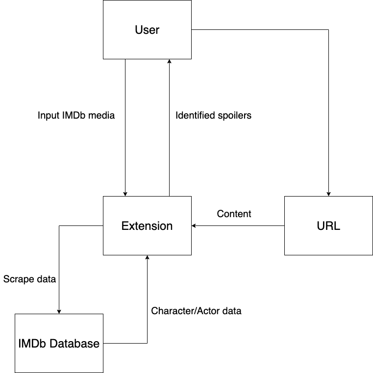
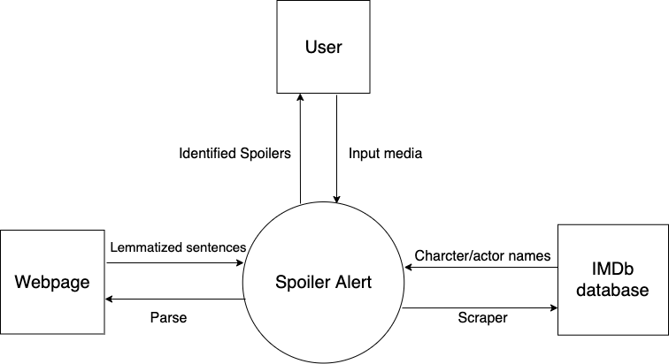
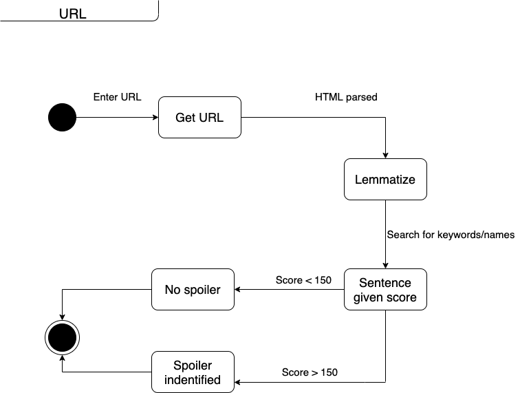
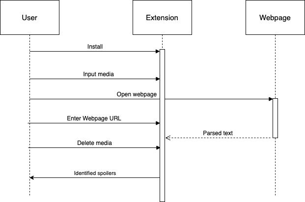
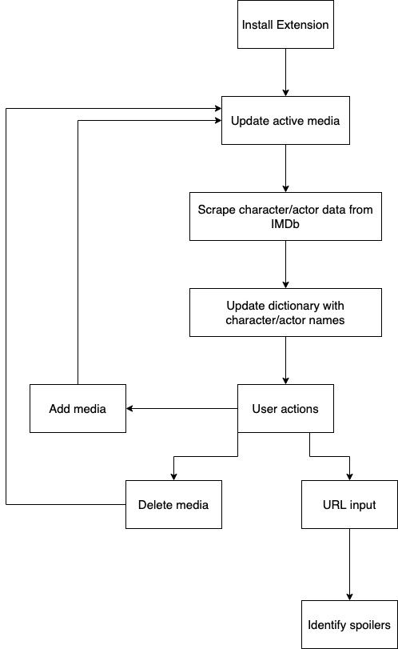

# Technical Specification for Spoiler Alert

### By Dearbhla Cunnion and Cormac Duggan

## Table of Contents
- 1. Introduction
    - 1.1 Overview
    - 1.2 Glossary
- 2. System Architecture
- 3. High-Level Design
    - 3.1 Context Diagram
    - 3.2 State Diagram
    - 3.2 Sequence Diagram
    - 3.3 High-Level Design Diagram
- 4. Problems and Resolution
    - 4.1 Chrome Extension Development
    - 4.2 Identifying Spoilers
    - 4.3 Parsing HTML text
- 5. Dependencies
- 6. User Installation
- 7. References and Sources

## 1. Introduction

### 1.1 Overview

The developed product is a Google Chrome extension called "Spoiler Alert", which aims to identify and block spoilers across the internet. 
Once downloaded, the user can input the movie(s) and/or TV show(s) that they do not want spoiled and the application then scrapes the input’s specific name
data(actors and characters) from IMDb using a python script. When a webpage is opened, the app first splits the HTML, leaving only the regular text. 
This is done by using the BeautifulSoup python library and extracting all non HTML script text. The application then parses the text into a tree using the
bllipparser python library and implements lemmatisation to transform each word back to their root, i.e "dying" is lemmatised to "die". 

Determination of a spoiler is done by the implementation of a scoring system. A dictionary of spoiler keywords that are sorted by their parts of speech (nouns, verbs,
adjectives, adverbs) is kept and each word is given a score out of 100. This score is determined by how likely that given word is to being a spoiler, e.g 
"kill" is given a high score of 90, while "anti-climax" is given a relatively low score of 20. Furthermore, when the name data is scraped from IMDb, it is also 
added to a dictionary. If any name of an actor and/or character is found in a sentence that also includes one of the spoiler keywords, the score for this
sentence is increased as it is likely a spoiler regarding this character or actor. Ultimately the score of a given sentence is computed and if the score is
greater than 150 then the text is deemed a spoiler and is blocked. If it is less than 150 it is not blocked. This is aimed to be as accurate as possible
but does require more testing for increased accuracy. 

### 1.2 Glossary

**Bllipparser**

A statistical natural language parser.

**Beautiful Soup**

A Python library for pulling data out of HTML and XML files.

**IMDb**

An online database of information related to film and television – including cast and character names

**Parsing**

The process of analyzing a string of symbols, either in natural language, computer languages or data structures, conforming to the rules of a formal grammar.

## 2. System Architecture

**_User:_** At any point in time a user can choose to download the extension, update their list of blocked content (this will access the IMDB Database 
then update the local user’s database), toggle or delete items from their list of blocked content (this will update the local user’s database), 
or access a web page which will run the analysis program and appropriately block spoilers.

**_Extension:_** The Spoiler Alert extension that is determines and blocks spoilers

**_URL:_** At any point in time the user can enter a webpage URL and the spoiler identification system will search this page
for spoilers

**_IMDb:_** Character and actor names are scraped from the media's IMDb page and put into a dictionary of keywords.

## 3. High-Level Design

### 3.1 Context Diagram

### 3.2 State Diagram

### 3.3 Sequence Diagram

### 3.4 High-Level Design Diagram

**Download Extension** 

Any user is able to access the application via the Google Chrome web store where they can download and install Spoiler Alert 
as a web extension. It will then add a small icon to the top right of the chrome window upon restarting the application.

**Update Media** 

Upon opening the extension, a dropdown menu showing all blocked content will appear with a search bar at the top. If a user enters
a valid piece of media the extension will proceed to the next step and add the given piece of media to the list below the search bar.

**Scrape Character/Actor Data from IMDB** 

Once a valid piece of media is searched for in the extension search bar, the character and actor data will be taken from the IMDB database for that piece
of content.
**Update dictionary with character/actor names** 

The data acquired from IMDB’s databases will then be added to a dictionary to appropriately keep track of the names identified with the selected media.

**User Actions -** 

Once any of the previous steps have been completed, assuming the application has been downloaded and installed, 
the user can proceed with browsing as normal or do a small set of actions applying to the extension itself.

  - **Add Media:** If the interface is opened by the user at any time they can search for new content and add it to their list of blocked media. 
This works the exact same as the previously described system and will update the user’s local database of spoiler content to block assuming the content 
is valid and can be located.
  - **Delete Media:** Similarly at any point in time the user can open the extension and, underneath the search bar, all their previously added blocked 
media will be displayed in a list. This list will have options to delete the content media from the
If the content is deleted from the list, the user’s database will remove that piece of media from itself and appropriately 
be updated.

## 4. Problems and Resolution

### 4.1 Chrome Extension Development

There was a bit of a learning curve when it came to developing the Chrome Extension as neither of us had ever created one before. There were many rules 
and required files that at times could lead to persistent errors in our code. Thankfully, the Chrome Development website goes into depth and explains most
things very well and simply. We tried to follow what the instructions and when we had errors that we did not understand we consulted StackOverflow for 
guidance.

### 4.2 Identifying Spoilers

Figuring out how to accurately identify spoilers in text was a challenge. We tried many different methods, such as just blocking certain words, but
ultimately we decided that we needed a more in depth approach. After discovering the bllipparser python library we struggled to learn how exactly the
parser worked. Specifically, we were not able to figure out how to install the library in the terminal. There was no pip install and persistent errors
when we tried to import the library. After researching the library a bit more we realised that it does not currently compile on most Mac OS machines,
which was the system we were using. A simple transfer over to the Linux lab machines fixed this and we were able to use the bllipparser from then on.

### 4.3 Parsing HTML text

From the start we knew we would have to take the HTML of a website and figure out how to strip it down to just the actual article content. Originally 
we tried to do this manually by creating a list of all HTML tags and trying to write a python script to remove these. Ultimately, this proved to be
troublesome and difficult to write. We then as a result started to search for python libraries that would help with this. Eventually we found the Beautiful 
Soup library which allowed us to split HTML text in very few lines.

## 5. Dependencies 

Before installing Spoiler Alert you will need to make sure the following are downloaded:

- [Beautiful Soup](https://www.crummy.com/software/BeautifulSoup/bs4/doc/#installing-beautiful-soup)
- [Bllipparser](https://pypi.org/project/bllipparser/)
- [Python3](https://www.python.org/downloads/)
- [Google Chrome](https://www.google.com/chrome/?brand=CHBD&gclid=EAIaIQobChMIj4vw2ceD6AIVxLTtCh2qjARJEAAYASABEgKbUvD_BwE&gclsrc=aw.ds)
- [NLTK library](https://www.nltk.org/install.html)

## 6. User Installation

1. Boot into Linux
2. Go to our [gitlab repository](https://gitlab.computing.dcu.ie/cunniod2/2020-ca326-cunniod4) 
3. Open the "code" folder
4. Download the folder called "Chrome Extension Stuff"
5. Copy and paste this link in the top searchbar: chrome://extensions/     **NOTE** You must copy and paste this link, simple clicking on it will not work
6. Toggle the developer mode switch in the top right corner
7. Click "Load Unpacked" option
8. Open the "Chrome Extension stuff" folder.
9. Spoiler Alert is now installed.

## 7. References and Sources

1. Bird, S., Klein, E. and Loper, E. (2019). *NLTK Book.* [online] Nltk.org. Available at: *https://www.nltk.org/book/* [Accessed 15 Feb. 2020].
2. Boyd-Graber, J., Glasgow, K. and Sauter Zajac, J. (2013). *Spoiler alert: Machine learning approaches to detect social media posts with revelatory information.* [online] asistdl.onlinelibrary.wiley.com/. Available at: *https://asistdl.onlinelibrary.wiley.com/doi/pdf/10.1002/meet.14505001073* [Accessed 15 Feb. 2020].
3. Charniak and Johnson (2016). *bllipparser.* [online] PyPI. Available at: *https://pypi.org/project/bllipparser/* [Accessed 15 Feb. 2020].
4. Collins, M. (2020). *Context Free Diagrams.* [online] Aritter.github.io. Available at: *http://aritter.github.io/courses/5525_slides/cfg.pdf* [Accessed 15 Feb. 2020].
5. Developer.chrome.com. (2020). *Content Security Policy (CSP) - Google Chrome.* [online] Available at: *https://developer.chrome.com/extensions/contentSecurityPolicy* [Accessed 15 Feb. 2020].
6. Navlani, A. (2019). *(Tutorial) Text ANALYTICS for Beginners using NLTK.* [online] DataCamp Community. Available at: *https://www.datacamp.com/community/tutorials/text-analytics-beginners-nltk* [Accessed 15 Feb. 2020].
7. Clips.uantwerpen.be. (2018). *Penn Treebank II tag set | CLiPS.* [online] Available at: *https://www.clips.uantwerpen.be/pages/mbsp-tags* [Accessed 15 Feb. 2020].
8. pythonprogramming.net. (2015). *Tokenizing Words and Sentences with NLTK.* [online] Available at: *https://pythonprogramming.net/tokenizing-words-sentences-nltk-tutorial/* [Accessed 15 Feb. 2020].
9. Developer.chrome.com. (2020). *What are extensions? - Google Chrome.* [online] Available at: *https://developer.chrome.com/extensions* [Accessed 15 Feb. 2020].

