# User Manual

### By Dearbhla Cunnion and Cormac Duggan

## Table of Contents
- 1. Introduction
- 2. Dependencies
- 3. Installation
- 4. Using Spoiler Alert

## Introduction

Our developed product is Spoiler Alert, a Google Chrome extension that identifies spoilers for a given TV show or movie. The actual extension development 
has not yet been completed, however the program can sufficiently block spoilers from a given webpage. This manual will show the user how to install and run 
Spoiler Alert.

## Dependencies
Before installing Spoiler Alert you will need to make sure the following are downloaded:
- [Beautiful Soup](https://www.crummy.com/software/BeautifulSoup/bs4/doc/#installing-beautiful-soup)
- [Bllipparser](https://pypi.org/project/bllipparser/)
- [Python3](https://www.python.org/downloads/)
- [Google Chrome](https://www.google.com/chrome/?brand=CHBD&gclid=EAIaIQobChMIj4vw2ceD6AIVxLTtCh2qjARJEAAYASABEgKbUvD_BwE&gclsrc=aw.ds)
- [NLTK library](https://www.nltk.org/install.html)

## Installation

1. Boot into Linux

2. Go to our [gitlab repository](https://gitlab.computing.dcu.ie/cunniod2/2020-ca326-cunniod4) 

3. Open the folder labelled "code"

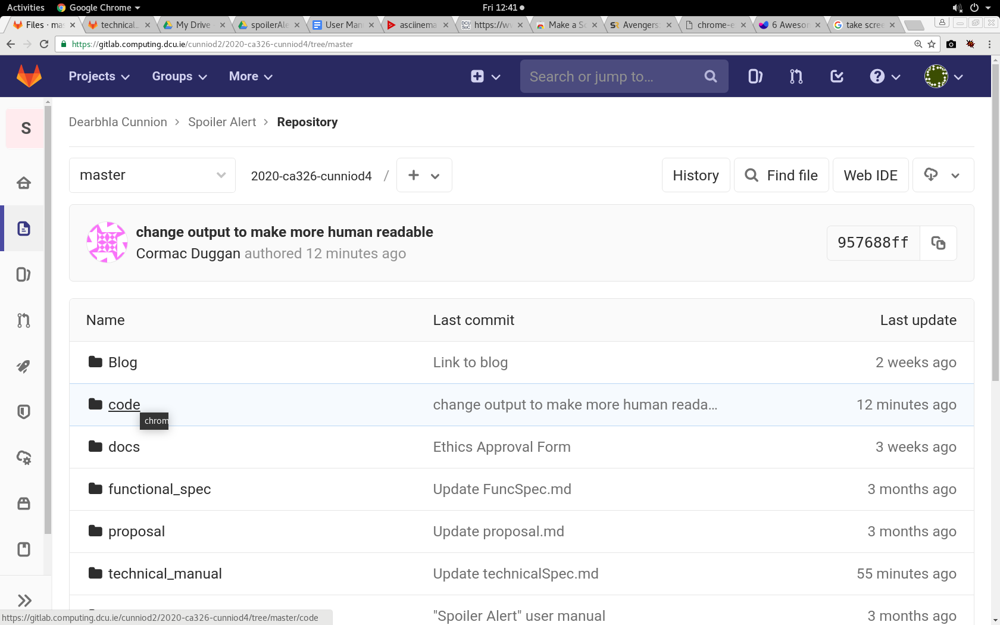

4. Download the folder labelled "Chrome Extension Stuff"

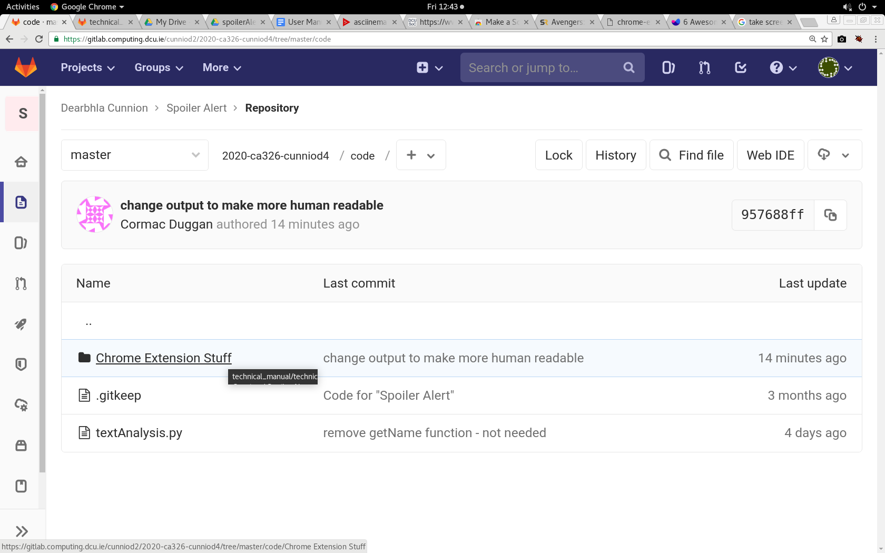

5. Copy and paste this link in the top search bar: chrome://extensions/ 
**NOTE:** You must copy and paste this link, simple clicking on it will not work

6. Toggle the developer mode switch

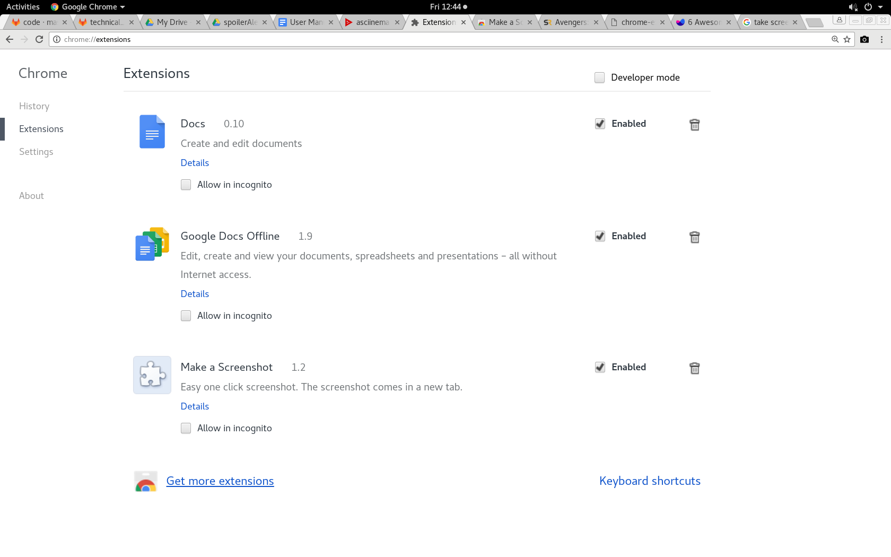

7. Click the “Load unpacked” option

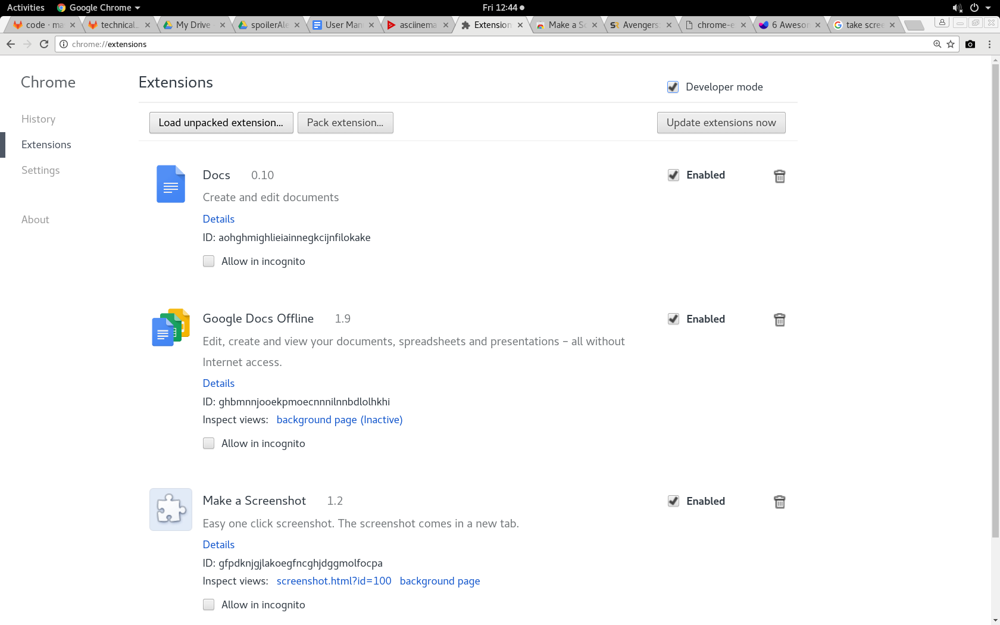

8. Open the previously downloaded “Chrome Extension Stuff” folder.  

9. Spoiler Alert is now installed.

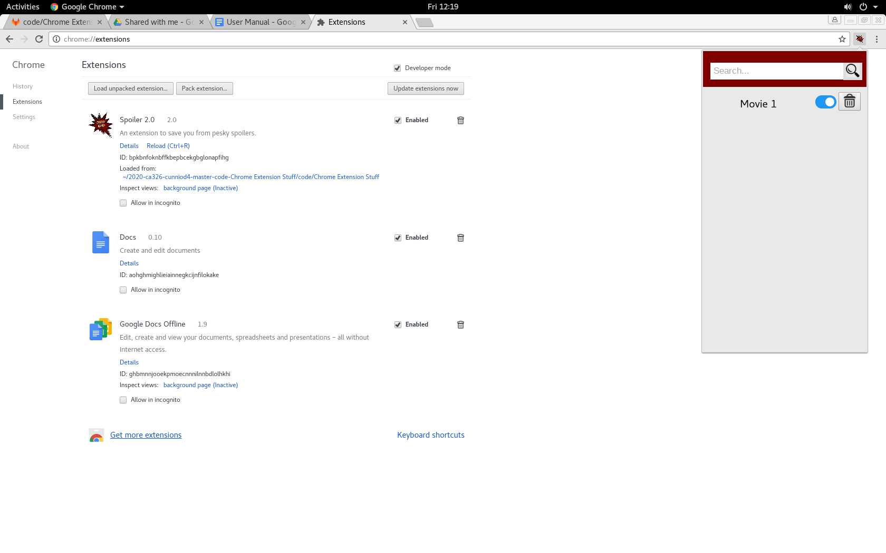

## Using Spoiler Alert

**NOTE:** The actual Chrome Extension itself does not yet work. However the program does work in the terminal. We will be running the program in the terminal. 

1. Open the "Chrome Extension Stuff" folder
2. Open the python file “getMedia.py”

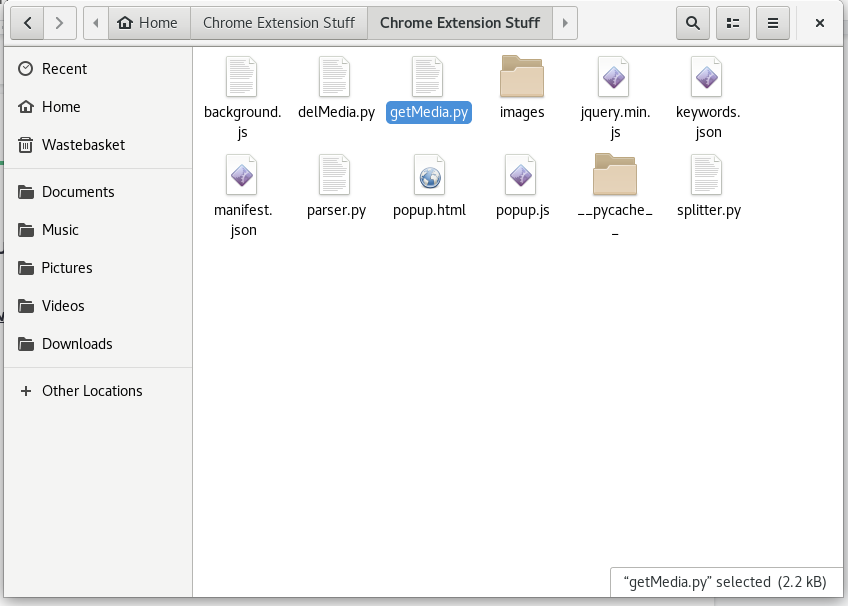

3. Scroll down to the bottom of the code file. You will see **getMedia(https://www.imdb.com/title/tt4154796/)**
This is the IMDb link for the movie “Avengers Endgame”. You can change this to any other IMDb page link for whatever movie/ TV show you want.

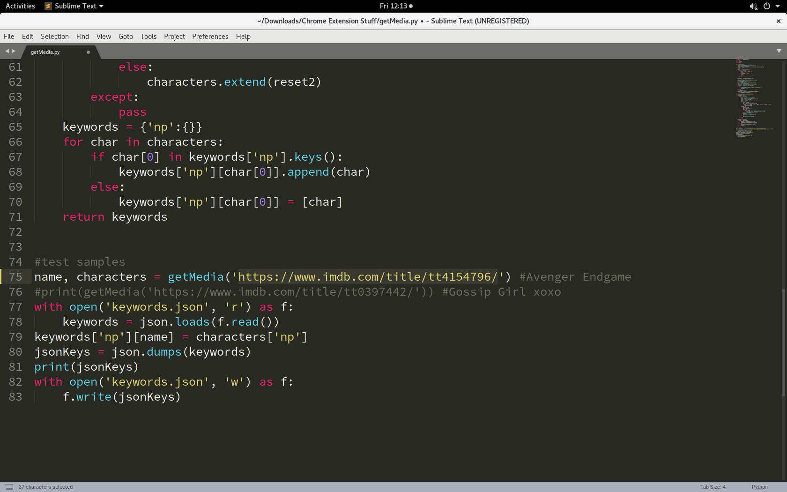

4. Run the getMedia.py program in the terminal.

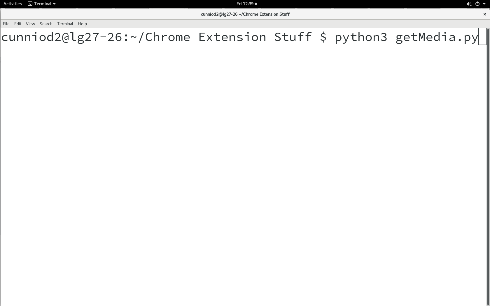

5. Open the python file “parser.py”

6. Scroll down to the main() function.

7. You may enter the link of any online article related to the film/ TV show you entered earlier in the highlighted area.  
For this example we will be using the article <https://screenrant.com/avengers-endgame-movie-spoilers/> 

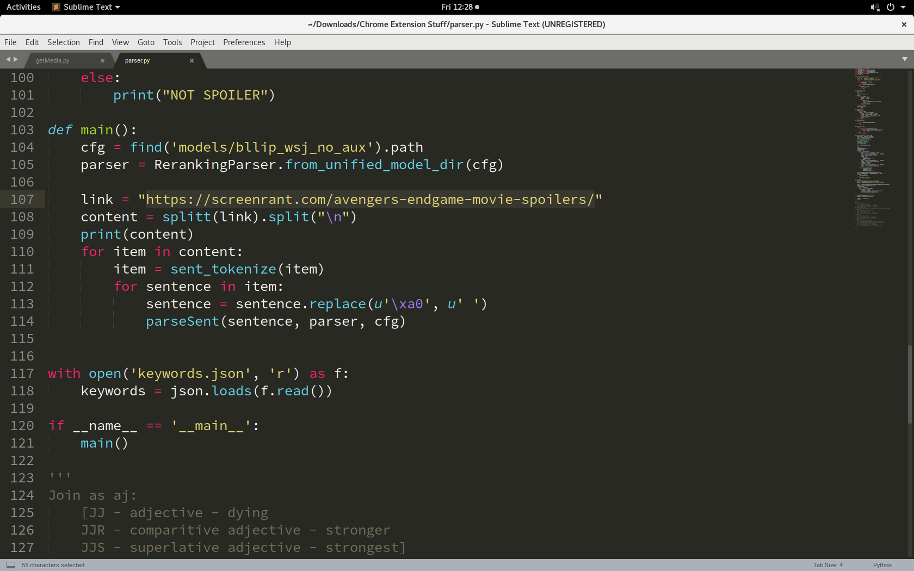

8. Run the parser.py file in the terminal

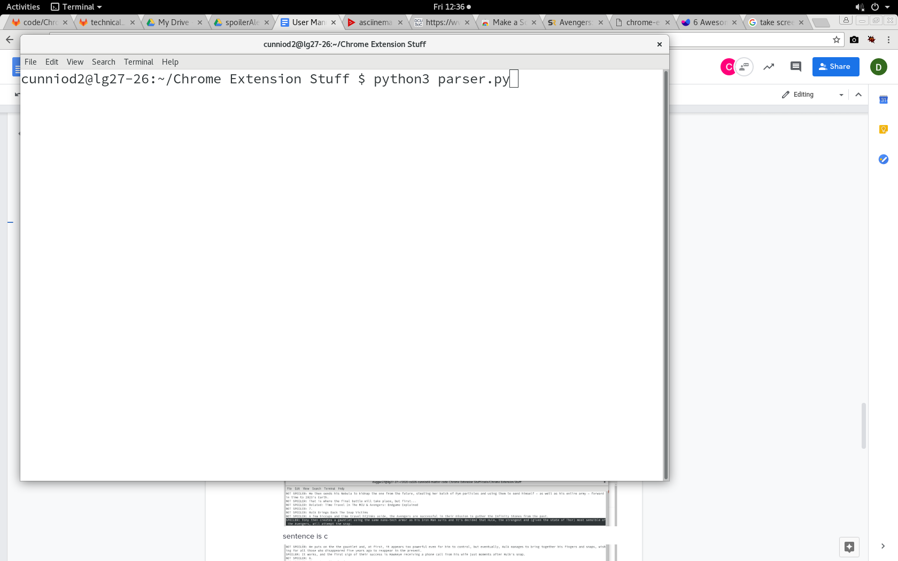

9. Each sentence is checked for a spoiler and identified.

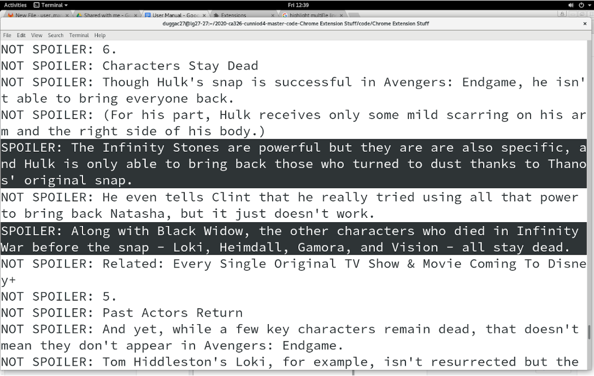

